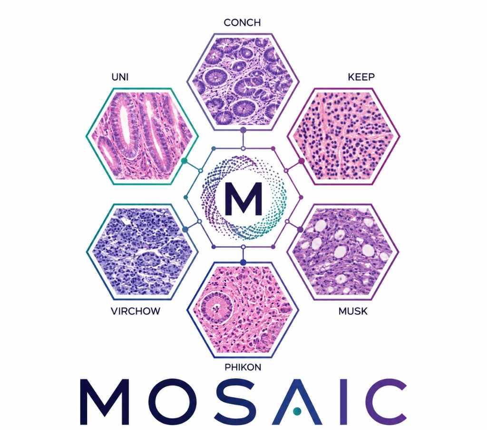

# 🧬 MOSAIC

> ### Towards a Universal Latent Space for Computational Pathology Foundation Models

<div align="center">
  
  <br/><br/>
  
  
</div>

<div align="center">

**🔬 18 encoders · 🩻 2 cohorts · 🧫 4,331 slides · 🎯 13 tasks**

</div>

MOSAIC tests whether independently trained computational-pathology foundation
models converge to a shared latent morphology space. This README is a practical
guide to **installing the code and running the study**. For the full method,
encoder registry, datasets, metrics and research questions, see the
[project website](https://researchsubmissions66.github.io/MOSAIC/).

---

## 📑 Contents

- [🔧 Setup](#-setup)
- [🚀 Run the full study](#-run-the-full-study)
- [🧩 Run a single stage](#-run-a-single-stage)
- [🩻 Layer-wise analysis (Phase IV)](#-layer-wise-analysis-phase-iv)
- [📊 Figures](#-figures)
- [🧪 Tests](#-tests)
- [📁 Repository layout](#-repository-layout)

---

## 🔧 Setup

```bash
# 1. environment (Python 3.10+)
conda create -n mosaic python=3.10 -y && conda activate mosaic

# 2. dependencies
pip install -r requirements.txt

# 3. point the code at your extracted trident feature store
#    edit configs/encoders.yaml  ->  feature_root: /path/to/trident_features
```

Core dependencies: numpy, scipy, scikit-learn, pandas, matplotlib, seaborn,
umap-learn, h5py, torch, pyyaml, joblib. The layer-wise stage additionally needs
`openslide` and a [trident](https://github.com/mahmoodlab/trident) checkout for
the model zoo.

Verify what features are on disk before running anything:

```bash
python scripts/scan_features.py --verify 2      # inventory + coordinate-pairing check
```

---

## 🚀 Run the full study

One command runs all seven stages in order: `inventory`, `similarity`,
`magnification`, `alignment`, `transfer`, `retrieval`, `downstream`.

```bash
python scripts/run_study.py --out results/smoke --preset smoke     # ~35 min, validates the chain
python scripts/run_study.py --out results/main  --preset standard
python scripts/run_study.py --out results/paper --preset full      # all 13 tasks, all aligners
```

| Preset | patches | latent dim | MIL epochs | tasks | aligners |
|---|---|---|---|---|---|
| `smoke` | 3k | 32 | 5 | 1 | joint_pca, gcca |
| `standard` | 20k | 64 | 50 | 4 | + procrustes |
| `full` | 50k | 64 | 80 | all 13 | + mcca, autoencoder |

Each stage is a separate subprocess, so one failure does not abort the rest and
any stage can be re-run on its own:

```bash
python scripts/run_study.py --out results/main --stages retrieval downstream
python scripts/run_study.py --out results/main --preset full --dry-run
```

Split across two GPUs (analysis on one, downstream on the other):

```bash
CUDA_VISIBLE_DEVICES=0 python scripts/run_study.py --out results/run/analysis \
    --preset full --stages inventory similarity magnification alignment transfer retrieval &
CUDA_VISIBLE_DEVICES=1 python scripts/run_study.py --out results/run/downstream \
    --preset full --stages downstream &
```

Logs land in `<out>/logs/<stage>.log`, and `<out>/run_manifest.json` records
exactly what ran.

---

## 🧩 Run a single stage

```bash
python scripts/representation_similarity.py --group best --n-patches 20000 --out results/sim
python scripts/magnification_ablation.py    --series best --out results/mag
python scripts/shared_latent_space.py       --group best --latent-dim 64 --out results/align
python scripts/cross_model_transfer.py      --list-pairs
python scripts/cross_model_retrieval.py     --group best --out results/retr
python scripts/downstream_mil.py --task tcga_nsclc --group master_benchmark/10x_256px --out results/mil
```

`--group best` resolves to the flagship 6-encoder group `cptac_benchmark/10x_256px`.
List the downstream tasks and their caveats with:

```bash
python scripts/downstream_mil.py --list-tasks
```

---

## 🩻 Layer-wise analysis (Phase IV)

This is the only stage that does **not** read the feature store: intermediate
block activations were never saved, so it re-runs the models with forward hooks
on re-cropped patches. It needs a few slides (already in the store) plus a trident
checkout for the weights.

```bash
python scripts/download_slides.py --n 4        # ~77 MB, slides already in the store
python scripts/layerwise_alignment.py \
    --encoders uni_v2 gigapath conch_v1 ctranspath resnet50 \
    --n-patches 512 --pool cls --out results/layerwise
```

`--pool {cls,mean,cls_mean}` selects how each block's tokens are reduced and
materially changes the result, so sweep it.

---

## 📊 Figures

```bash
python scripts/make_figures.py --run results/full_run --out results/figures --format pdf
```

---

## 🧪 Tests

```bash
python -m pytest tests/ -q                 # full suite
python -m pytest tests/ -q -m "not slow"   # skip the model-training tests
```

Tests assert mathematical invariants (self-similarity = 1, rotation and scale
invariance, near-chance behaviour on independent data, GCCA eigenvalue bounds,
patient-split leakage, ranking-metric correctness), not just output shapes.

---

## 📁 Repository layout

```
scripts/    entry points: run_study.py plus one script per stage
utils/      metrics, aligners, transfer, retrieval, MIL, feature store
configs/    encoders.yaml registry + downloaded clinical / mutation labels
tests/      property tests
index.html  public project page and interactive result browser
```
