# MOSAIC

> **Towards a Universal Latent Space for Computational Pathology Foundation Models**

<div align="center">
  
  <br/><br/>
  
  
</div>

<div align="center">

**18 encoders · 2 cohorts · 4,331 slides · 13 tasks**

</div>

MOSAIC asks whether independently trained computational-pathology foundation
models preserve enough common morphology to support a shared representation
space. The study follows that question from geometry to utility:

| Lens | Scientific question | Evidence produced |
|---|---|---|
| **Similarity** | Do encoders organize the same tissue in comparable ways? | Seven complementary representational-similarity metrics |
| **Alignment** | Can model-specific coordinates be mapped into one shared space? | Five multiview alignment methods and cross-model identity retrieval |
| **Translation** | Does the shared space preserve information unique to each encoder? | Directional cross-encoder representation translation |
| **Downstream utility** | Is the shared space useful beyond geometric agreement? | Best-single, concatenated, and MOSAIC MIL comparisons across 13 tasks |

The central workflow is:

```text
model-specific spaces → geometry audit → multiview alignment → shared latent space
                                                            ↘ retrieval · translation · MIL
```

## Study scope

| Cohort | Included subcohorts | Slides |
|---|---|---:|
| TCGA | BRCA (1,126), LUAD/LUSC (1,043) | 2,169 |
| CPTAC | BRCA (654), LUAD (1,139), COAD (369) | 2,162 |
| **Total** | **5 included subcohorts across 2 cohorts** | **4,331** |

The benchmark reports **13 downstream tasks**: 4 morphological/clinical tasks
and 9 molecular-prediction tasks. TCGA-RCC and CPTAC-LSCC are excluded from
the reported study scope and slide total.

This repository contains the experiment orchestration, analysis code, tests,
and interactive project page needed to reproduce that workflow. For the full
encoder registry, datasets, metrics, results, and research questions, see the
[project website](https://researchsubmissions66.github.io/MOSAIC/).

---

## Contents

- [Setup](#setup)
- [Run the full study](#run-the-full-study)
- [Run one analysis](#run-one-analysis)
- [Reproduce figures](#reproduce-figures)
- [Tests](#tests)
- [Repository map](#repository-map)

---

## Setup

```bash
# 1. environment (Python 3.10+)
conda create -n mosaic python=3.10 -y && conda activate mosaic

# 2. dependencies
pip install -r requirements.txt

# 3. point the code at your extracted trident feature store
#    edit configs/encoders.yaml  ->  feature_root: /path/to/trident_features
```

Core dependencies: numpy, scipy, scikit-learn, pandas, matplotlib, seaborn,
umap-learn, h5py, torch, pyyaml, joblib.

Verify what features are on disk before running anything:

```bash
python scripts/scan_features.py --verify 2      # inventory + coordinate-pairing check
```

---

## Run the full study

One command runs all seven stages in order: `inventory`, `similarity`,
`magnification`, `alignment`, `transfer`, `retrieval`, `downstream`.

```bash
python scripts/run_study.py --out results/smoke --preset smoke     # ~35 min, validates the chain
python scripts/run_study.py --out results/main  --preset standard
python scripts/run_study.py --out results/paper --preset full      # all 13 tasks, all aligners
```

| Preset | Patches | Latent dimension | MIL epochs | Tasks | Aligners |
|---|---|---|---|---|---|
| `smoke` | 3k | 32 | 5 | 1 | joint_pca, gcca |
| `standard` | 20k | 64 | 50 | 4 | + procrustes |
| `full` | 50k | 64 | 80 | all 13 | + mcca, autoencoder |

Each stage is a separate subprocess, so one failure does not abort the rest and
any stage can be re-run on its own:

```bash
python scripts/run_study.py --out results/main --stages retrieval downstream
python scripts/run_study.py --out results/main --preset full --dry-run
```

Split across two GPUs (analysis on one, downstream on the other):

```bash
CUDA_VISIBLE_DEVICES=0 python scripts/run_study.py --out results/run/analysis \
    --preset full --stages inventory similarity magnification alignment transfer retrieval &
CUDA_VISIBLE_DEVICES=1 python scripts/run_study.py --out results/run/downstream \
    --preset full --stages downstream &
```

Logs land in `<out>/logs/<stage>.log`, and `<out>/run_manifest.json` records
exactly what ran.

---

## Run one analysis

```bash
python scripts/representation_similarity.py --group best --n-patches 20000 --out results/sim
python scripts/magnification_ablation.py    --series best --out results/mag
python scripts/shared_latent_space.py       --group best --latent-dim 64 --out results/align
python scripts/cross_model_transfer.py      --list-pairs
python scripts/cross_model_retrieval.py     --group best --out results/retr
python scripts/downstream_mil.py --task tcga_nsclc --group master_benchmark/10x_256px --out results/mil
```

`--group best` resolves to the flagship 6-encoder group `cptac_benchmark/10x_256px`.
List the downstream tasks and their caveats with:

```bash
python scripts/downstream_mil.py --list-tasks
```

---

## Reproduce figures

```bash
python scripts/make_figures.py --run results/full_run --out results/figures --format pdf
```

---

## Tests

```bash
python -m pytest tests/ -q                 # full suite
python -m pytest tests/ -q -m "not slow"   # skip the model-training tests
```

Tests assert mathematical invariants (self-similarity = 1, rotation and scale
invariance, near-chance behaviour on independent data, GCCA eigenvalue bounds,
patient-split leakage, ranking-metric correctness), not just output shapes.

---

## Repository map

```
scripts/    entry points: run_study.py plus one script per stage
utils/      metrics, aligners, transfer, retrieval, MIL, feature store
configs/    encoders.yaml registry + downloaded clinical / mutation labels
tests/      property tests
index.html  public project page and interactive result browser
```
